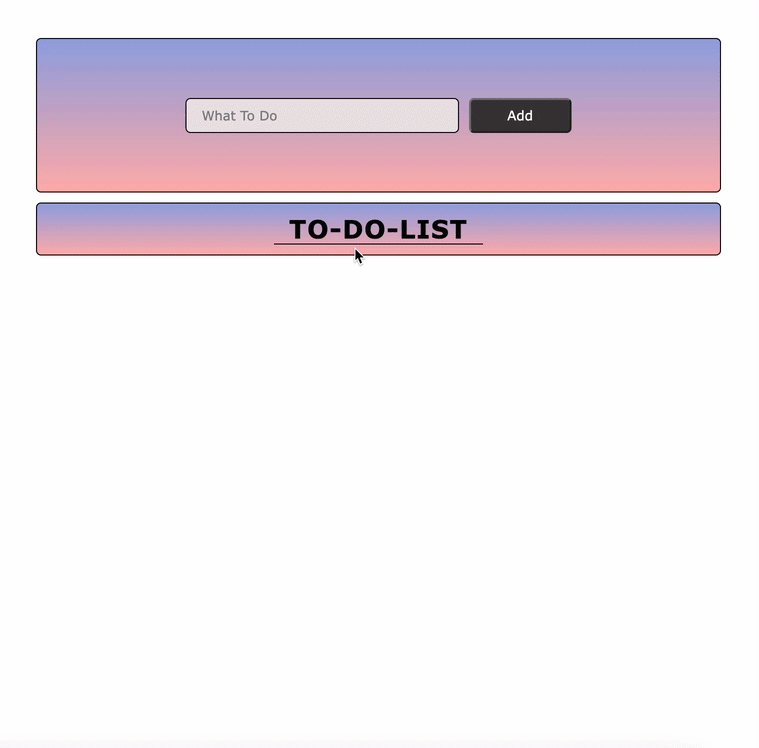

# To-Do-List

<h3> To Do List app made with HTML-CSS and JavaScript </h3>

<h5>Hit enter to add new To-Do.   
Delete item with X button located at right side.  
Alert message appears if you try add something without any input text.   

</h5>

